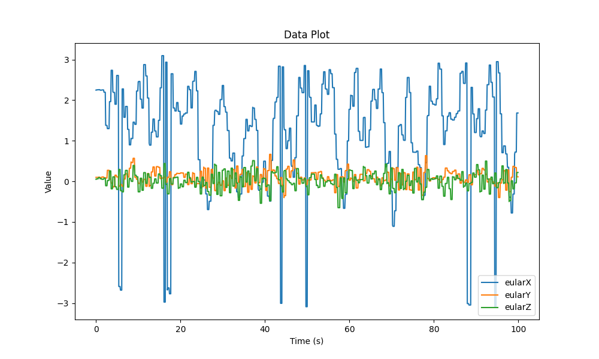

# I learn work

손잡이 MPU9250 센서로부터 값을 받아오는데 누적 오차로 인한 데이터값이 선형적으로 증가하는 문제가 발생하였습니다.

이 문제를 해결하기 위해 Madgwick 필터를 적용하기로 하였습니다. 
Madgwick 필터란 3축 자이로스코프와 가속도계, 3축 자력계를 포함하는 MARG 어레이로 구성된 IMU에 적용할 수 있는 방향 필터입니다.

필터는 방향의 쿼터니언 표현을 사용하여 3차원 방향의 특성을 설명하고 오일러 각도 표현과 관련된 특이성의 영향을 받지 않으므로 분석적으로 파생되고 최적화된 경사 하강 알고리즘에서 가속도계 및 자력계 데이터를 사용할 수 있습니다. 자이로스코프 측정 오류의 방향을 쿼터니언 도함수로 계산합니다.

이 필터의 혁신적인 측면은 다음과 같습니다.

- 관찰 가능한 시스템 특성에 의해 정의된 조정 가능한 단일 매개변수입니다.
- 분석적으로 파생되고 최적화된 경사 하강 알고리즘은 낮은 샘플링 속도에서 성능을 가능하게 합니다.
- 온라인 자기 왜곡 보상 알고리즘.
- 자이로스코프 바이어스 드리프트 보상.
- 이를 해결하기 위해 Madgwick 필터를 적용한 모습입니다.

센서 프레임을 기준으로 한 지구 프레임의 방향 
 시간에
쿼터니언 도함수를 수치적으로 적분하여 계산할 수 있습니다.
처럼:

    

    

