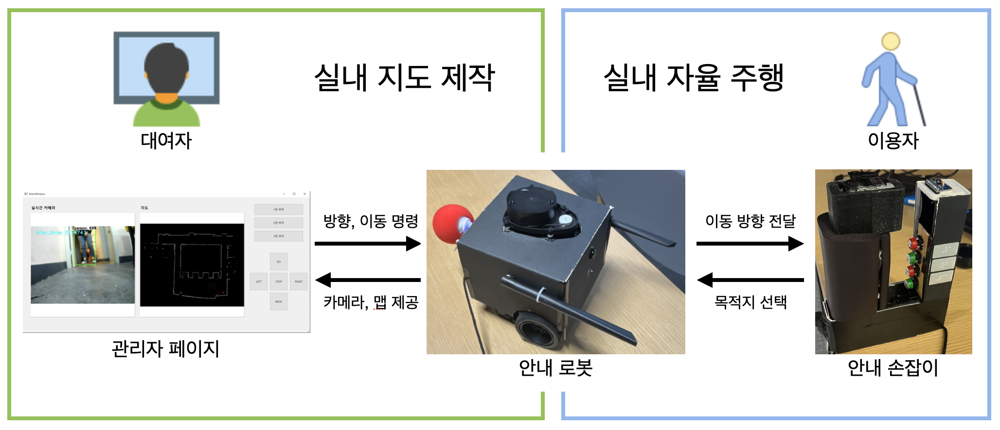

# LBO(엘보)
목차
1. [개요](#개요)
2. [배경](#배경)
3. [목표](#목표)
4. [설계](#설계)
5. [주요 기능](#주요-기능)
6. [결과](#결과)
7. [홍보](#홍보)
8. [참고](#참고)
9. [문서 이력](#문서-이력)

## 개요
본 프로젝트는 삼성 청년 SW 아카데미 심화 과정 (2학기) 中 자율 프로젝트[1](#footnote_1)의 일환으로 시각장애인의 실내 이동의 어려움을 해소하고자 제안하는 프로젝트임.

## 배경
### 시각장애인의 보행 관련 서비스
---
|||
|:---:|:---:|
|G-EYE 어플리케이션 화면[2](#footnote_2)|서울특별시립노원시각장애인복지관의 교육 프로그램[3](#footnote_3)|
- 전맹 시각장애인을 위한 보행 내비게이션 & 비대면 주문 결제 서비스 **G-EYE**[2](#footnote_2) 어플이 존재함. (왼쪽)
- 현재 서울특별시립노원시각장애인복지관에서 3월 IT역량강화교육 프로그램 중 "시각장애인 앱 활용 교육"에 선정될 만큼 유용성이 높음. (오른쪽)
- 이외에도 GPS 기반 위치 추정 및 경로 안내 방안들이 많이 제시되고 있음.

### 실내 안내 서비스의 필요성 및 개발 사례
---
|||
|:---:|:---:|
|실내 공간 이용 시 느끼는 주관적 어려움 정도 (평균)[4](#footnote_4)|주식회사 휴먼케어의 장애인 실내 내비게이션 사례[5](#footnote_5)|

- 백화점, 실내 문화 시설, 강의용 건물 등을 실내 공간을 이용하는데 어렵다고 느끼는 비율이 약 78%임. (조성재 et al., 2020[4](#footnote_4))
- 한국지능정보사회진흥원(NIA)의 사업으로 주식회사 휴먼케어가 장애인 실내 내비게이션 **길안내** 애플리케이션을 개발함.
- 해당 서비스에 사용된 기술로는 비콘(Beacon), 지구자기장 등을 활용한 위치 측위 기술과 각종 센서값, 건축 도면 정보등을 활용함.

### 문제점
앞선 사례들에 활용된 기술과 한계는 다음과 같음.
|기술|설명|
|:---:|:---|
|GPS|실내 환경에서는 주변 벽으로 인해 신호가 약해지기 때문에 정확도가 매우 떨어짐|
|IPS (Beacon, 태그 등)|GPS를 대체할 실내 위치 추적 시스템이지만 실내 공간에 위치 추정을 위한 기기들을 설치 및 관리해야 함|
---
- 실내 공간이 넓으면 넓을수록 IPS를 구축하기 위한 비용은 증가됨.
- 시각장애인의 방문 빈도가 낮을수록 IPS 환경 구축의 당위성이 낮아짐.
- 이러한 문제로 인해 시각장애인은 처음 방문하는 곳에서 편하게 돌아다니는데 어려움을 극복하는데 한계가 있음.

## 목표
> **쉽게 실내 지도를 만들고 이를 시각장애인에게 알려주는 서비스를 개발하자**

## 설계
### 정의 
설계 앞서 다음과 용어들에 대해 다음과 같이 정의함.
|용어|정의|
|:---:|:---|
|대여자|비시각장애인으로 본 기기를 대여하여 이용자에게 서비스 이용 환경을 제공하고자 하는 자|
|이용자|시각장애인으로 대여자가 환경에 맞게 세팅한 본 기기를 기반으로 실내 이동하는 자|
|기기|안내 로봇과 안내 손잡이를 모두 칭함|
|[안내 로봇](../Robot/README.md)|이용자의 이동을 희망하는 곳으로 실내 안내를 해주는 로봇|
|[안내 손잡이](../Handle/README.md)|이용자가 이동하길 원하는 목적지를 선택하는 제품|
|[관리자 페이지](../Qt/README.md)|대여자가 이용자를 위해 실내 환경을 로봇에게 학습시키는 프로그램|
---
### 구조도
[정의](#정의)에 의해 본 서비스는 다음과 같이 설게함.

## 주요 기능
세부 사항은 각 문서들을 참고를 권장함.
|분류|대여자|이용자|
|:---:|:---:|:---:|
|[안내 로봇](../Robot/README.md)|실내 지도 생성|실내 경로 안내, 음성 안내|
|[안내 손잡이](../Handle/README.md)|x|실내 목적지 선택|
|[관리자 페이지](../Qt/README.md)|안내 로봇 조종, 실내 지도 확인 및 제거, 주요 목적지 선정|x|

## 결과

## 홍보

## 참고
1. <a name="footnote_1"> 앞선 프로젝트 경험을 바탕으로 자유롭게 팀 주제를 선정하여 자신의 아이디어를 구현하는 프로젝트 </a>
2. <a name="footnote_2">[LBS tech사에서 개발한 어플리케이션](https://ko.lbstech.net/service-g-eye-plus) </a>
3. <a name="footnote_3"> [서울특별시립노원시각장애인복지관 "모집/신청 - [모집] 2024년 3월 IT역량강화교육 참가자 모집" 사단법인 한국시각장애인연합회 (2024.02.15.)](http://www.kbuwel.or.kr/Board/Wanted/Detail?page=1&contentSeq=1215123) </a>
4. <a name="footnote_4"> [조성재, 김호연, 김민 "시각장애인 실내보행용 앱 개발을 위한 욕구 및 선호 연구" 시각장애연구 36.4 pp.1-21 (2020) : 1.](http://mm.sookmyung.ac.kr/~sblim/lec2/SW_weak/weak22/paper_202012_indoor_navi.pdf) </a>
5. <a name="footnote_5"> [박지원 "장애인 '실내'내비게이션?장애인 국회의원들이 직접 나섰다" 소셜포커스 (2021.04.29.)](https://www.socialfocus.co.kr/news/articleView.html?idxno=10010) </a>

## 문서 이력
|Ver.|Desc.|Author|Date|Notes|
|:---:|:---|:---:|:---:|:---|
|0.1|Project Report 초안 작성|정현우|2024-05-24||
|0.2|배경 작성|정현우|2024-05-28||
|0.3|목표, 설계, 주요기능, 홍보 초안 작성|정현우|2024-06-02||
|0.4|구조도 작성|정현우|2024-06-03||