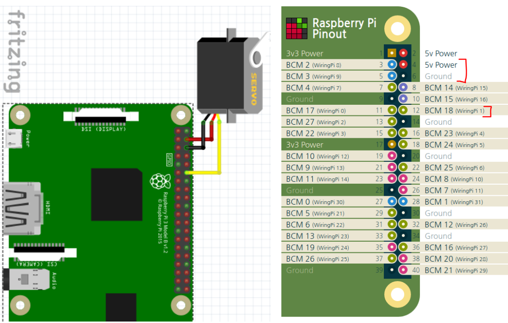
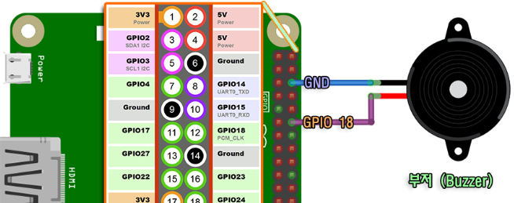

# 손잡이 개발 문서

작성자: 김영래

## 목록
### 1. 모듈 사용 예시 코드 및 핀 배치도
    - 1.1. IMU (MPU6050 / MPU 9250)
    - 1.2. UWB(DWM 1000)
    - 1.3. 서보모터 (MG996R)
    - 1.4. 블루투스 통신
    - 1.5. 버튼
    - 1.6. 부저
    - 1.7. 멀티 쓰레딩

2. 미정


## 1. 모듈 사용 예시 코드 및 핀 배치도
### 1.1. IMU (MPU6050 / MPU 9250)
---
Interface: I2C

PIN: 

비고: 실제 사용은 MPU 9250이나 현재 없는 관계로 MPU 6050으로 대체하겠음

### 1.2. UWB(DWM 1000)
---
Interface: SPI

PIN: 

비고:  


### 1.3. 서보모터(MG996R)
---
Interface: PWM

PIN: VCC - 5V, GND - GND, PWM - 12(BCM 18)



[그림 1 - 서보모터 핀 배치]

비고: 


참고자료: https://blog.naver.com/chandong83/221850060160

코드: 
```python
import RPi.GPIO as GPIO
from time import sleep

servoPin          = 12
SERVO_MAX_DUTY    = 12
SERVO_MIN_DUTY    = 3

GPIO.setmode(GPIO.BOARD) # 핀 번호를 BCM으로 하고 싶다면 GPIO.setmode(GPIO.BCM)
GPIO.setup(servoPin, GPIO.OUT)

servo = GPIO.PWM(servoPin, 50)
servo.start(0)


def setServoPos(degree):
  if degree > 180:
    degree = 180

  duty = SERVO_MIN_DUTY+(degree*(SERVO_MAX_DUTY-SERVO_MIN_DUTY)/180.0)
  print("Degree: {} to {}(Duty)".format(degree, duty))

  servo.ChangeDutyCycle(duty)


if __name__ == "__main__":
  setServoPos(0)
  sleep(1)
  setServoPos(45)
  sleep(1)

  setServoPos(90)
  sleep(1)


  setServoPos(135)
  sleep(1)

  setServoPos(180)
  sleep(1)


  servo.stop()

  GPIO.cleanup()
```


### 1.4. 블루투스 통신
---
Interface: 없음

PIN: 없음

비고: Bluetooth 4.2 (BLE)


### 1.5. 버튼
Interface: GPIO

PIN: 


비고: 인터럽트 사용


### 1.6. 부저
---
Interface: PWM

PIN: GND - GND, PWM - 12(BCM 18)



[그림 2 - 부저 사진]

비고: 

참고자료: https://rasino.tistory.com/entry/%E3%80%90%EB%9D%BC%EC%A6%88%EB%B2%A0%EB%A6%ACPi20%E3%80%91-%ED%94%BC%EC%97%90%EC%A1%B0-%EB%B6%80%EC%A0%80-%EC%82%AC%EC%9A%A9%ED%95%98%EA%B8%B0-with-%ED%8C%8C%EC%9D%B4%EC%8D%AC-%EC%BD%94%EB%93%9C

코드: 
```python
import RPi.GPIO as GPIO
import time


buzzer = 12
GPIO.setmode(GPIO.BOARD)
GPIO.setup(buzzer, GPIO.OUT)
GPIO.setwarnings(False)
pwm = GPIO.PWM(buzzer, 262)


if __name__ == "__main__":
    pwm.start(50.0)
    time.sleep(0.5)
    pwm.stop()

    GPIO.cleanup()
```


### 1.7. 멀티 쓰레딩
---
Interface: 없음

PIN: 없음

비고: 

예제코드1: task1 과 task2로 1, 2초마다 print하는 코드


<br><br>


예저코드2: task1을 수행하고 task2를 호출(join) 후 exit

