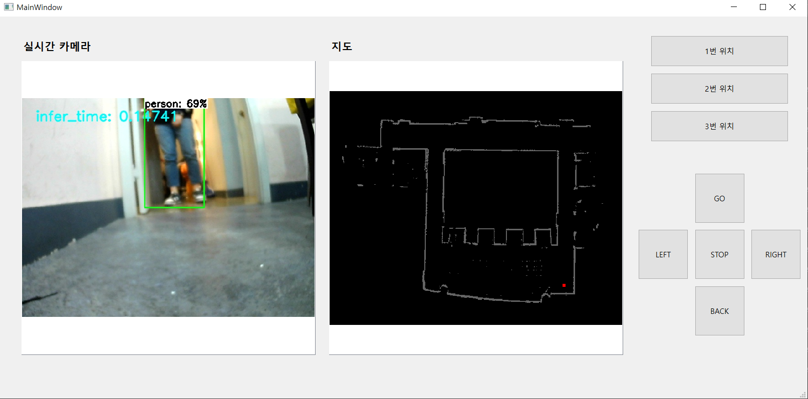
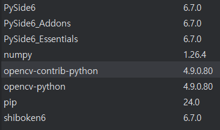

# Qt
Author: 김영래, 김태환

Date(Latest): 2024-05-23

요약: 관리자 페이지 개발 


## 목록
- [1. 관리자 페이지(Qt,PySide6 + ROS2)](#1-관리자-페이지qtpyside6--ros2)

- [2. 포팅 메뉴얼 (Qt, PySide6)](#2-포팅-메뉴얼-qt-pyside6)

- [3. 포팅 메뉴얼 (ROS2)](#3-포팅-메뉴얼-ros2)

- [4. 조작](#4-조작)

- [5.완성본 설치: Qt 맵 생성 프로그램 설치 매뉴얼](#5-완성본-설치-qt-맵-생성-프로그램-설치-매뉴얼)


## 1. 관리자 페이지(Qt,PySide6 + ROS2)





구입 후 초반에 관리자가 쉽게 맵핑이 가능하도록 만든 원격조작 툴이다.

<br><br>

## 2. 포팅 메뉴얼 (Qt, PySide6)


파이참을 설치한다. (파이썬이 자동으로 설치되며, 가상환경도 스스로 만든다.)

설정으로 간다.  (File > Setting > Project: pythonProject > Python Interpreter)

+버튼을 눌러서 패키지를 설치한다.



이제 UI를 만든다.

pythonProject위치 > .venv > Lib > Scripts > pyside6-designer.exe를 실행하고, 원하는 UI를 배치한다.

필요한 인터럽트도 마저 설정한다.

```bash
Project> .\.venv\Scripts\pyside6-uic.exe .\mainUI.ui -o .\mainUI.py
```

위 명령어를 통해 파이썬 코드로 변경한다.

아래 main.py의 기본 코드를 이용해 개발을 진행한다.

```python
import cv2
import numpy as np
import random
from PySide6.QtWidgets import *
from PySide6.QtGui import QPixmap, QImage, QColor
from mainUI import Ui_MainWindow
from PySide6.QtCore import Qt, QSize, QRectF

class MyApp(QMainWindow, Ui_MainWindow):
    def __init__(self):
        super().__init__()
        self.setupUi(self)
        self.main()

    def main(self):
        pass

if __name__ == '__main__':
    app = QApplication()
    win = MyApp()
    win.show()
    app.exec()
```

<br><br>

## 3. 포팅 메뉴얼 (ROS2)

아무 폴더 위치에서 아래 지시사항을 수행한다.

```python
1. ros2_ws 폴더 만들기
2. ros2_ws 폴더 들어가기
3. src 폴더 만들기
4. call C:\dev\ros2_eloquent\setup.bat (이건 터미널 새로 켤때마다 해야함)
5. ros2 pkg create --build-type ament_python 폴더명 (나는 qqt로 함 -> 소문자로 꿈 qqt)
6. qqt를 두번 들어간다. (같은 이름이 두번 있음)
7. pip install PySide6 (없어서 했음)
8. qqt를 두번 들어가면 __init__.py가 있는데, 여기에 내 파이썬 Qt파일(main.py, mainUI.py)을 복사한다. 
9. src/qqt에 있는 setup.py에서 
entry_points={
        'console_scripts': [
            'talker1 = qqt.main:main',
            'talker2 = qqt.Ui_MainWindow:main',
        ],
    },

// 맨 마지막은 무조건 main이 되도록

10. ros2_ws 폴더로 이동한다.
11. colcon build
12. call C:\Users\SSAFY\ros2_ws\install\local_setup.bat
13. ros2 run qqt talker1
```

```bash
pip install PySide6
pip install opencv-contrib-python
pip install opencv-python
```

<br><br>

## 4. 조작


위 사진처럼 왼쪽에 카메라 사진, 오른쪽에 맵의 사진을 띄운다.

두 사진은 ROS2 통신으로 Topic을 Subscribe하여 가져온다. 

카메라는 RGB, 맵은 GreyScale이 되도록 전처리 과정을 진행한다.

Qt의 키보드(또는 버튼)의 인터럽트를 이용하여 Twist값을 Publish한다. 이를 통해 로봇의 조작이 가능케 한다.

<br><br>

## 5. 완성본 설치: Qt 맵 생성 프로그램 설치 매뉴얼

---

- 사전 환경 세팅
    - SSAFY에서 제공한 개발환경 구축 매뉴얼에 따라 ROS 설치 및 환경 세팅 필요
    - 추가로 파이썬 라이브러리 설치 필요
        
        ```powershell
        pip install PySide6
        pip install opencv-python
        ```
        

1. ros2_ws2.zip 압축파일을 푼다.
2. ros2_ws2 폴더 내에 Qt_setup.bat 파일을 실행한다.
    - Qt_setup.bat 명령어
        
        ```powershell
        call C:\dev\ros2-eloquent\setup.bat
        colcon build
        call install\local_setup.bat
        ```
        
        - 만약 ros2 설치 위치가 다르다면 cmd창을 열고 본인이 설치한 ros2 설치 위치의 setup.bat 파일을 call해야 함
3. Qt_start.bat파일을 실행한다.
    - Qt_start.bat 명령어
        
        ```powershell
        call C:\dev\ros2-eloquent\setup.bat
        call install\local_setup.bat
        ros2 run map_draw app1
        ```